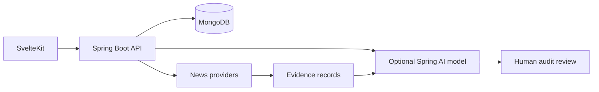

# TrueYield

> Academic portfolio prototype for human-reviewed ESG evidence workflows. It is **not** a production system, regulatory compliance solution, investment recommendation, or greenwashing detection engine.

TrueYield demonstrates how a fund manager can submit a portfolio for review, how a reviewer can inspect collected evidence, and how an auditor can record an approval or rejection with a rationale. The project was built as a Business Information Systems portfolio project at ZHAW.

## What is implemented

- Java / Spring Boot API with MongoDB persistence and Auth0 JWT role mapping.
- SvelteKit frontend for Fund Manager, Auditor and Compliance Officer views.
- Portfolio, holding, evidence, comments and controlled audit-state workflow.
- Advisory AI analysis that uses supplied evidence snippets, stores analysis metadata and retains cited evidence IDs when output is valid.
- Human review with a required decision rationale and an application-level audit history for new reports.
- Docker, GitHub Actions, backend unit tests, frontend checks and Azure deployment configuration.

## Important limitations

- News-provider data is external and can be incomplete, stale or unavailable.
- The AI integration is optional. If unavailable, no risk score is invented; the report is marked as unavailable or insufficiently evidenced for human review.
- AI output is advisory, not validated model performance. No accuracy, recall, greenwashing-detection or regulatory-compliance claim is made.
- Existing reports created before the provenance change are retained as legacy reports and do not gain artificial history.
- The audit history is an application-level record; it is not an immutable, legally sufficient audit trail.
- The current compliance dashboard is a demonstration view, not a regulatory classification or reporting feature.

## Workflow

1. A Fund Manager creates a portfolio and holdings.
2. An audit report triggers evidence collection before advisory analysis is attempted.
3. The system stores the analysis state, prompt version, model identifier, input evidence count and cited evidence IDs.
4. An Auditor assigns the report, inspects evidence and records an approval or rejection with a rationale.
5. Compliance can inspect organisation-wide, non-regulatory evidence signals.

## Architecture



## Local setup

Prerequisites: Java 25, Node.js, MongoDB, and Auth0 credentials for authenticated flows. AI analysis additionally requires a configured Anthropic API key; it is optional.

```powershell
cd backend
.\mvnw.cmd verify

cd ..\frontend
npm ci
npm run check
npm run build
```

The automated backend unit suite runs without a locally reachable MongoDB instance. Mongo integration checks require Docker or MongoDB and are executed in CI with the configured service.

## Verification

```powershell
cd backend; .\mvnw.cmd verify
cd frontend; npm run check; npm run build
```

## Career-safe project description

Built a full-stack academic prototype for a human-reviewed ESG evidence workflow using Spring Boot, SvelteKit, MongoDB and Auth0. Implemented role-based portfolio review, evidence collection, advisory AI analysis with provenance metadata, and an auditor decision flow with automated tests and CI.

## Historical material

The former investor-style pitch remains in [`docs/archive/TrueYield_Pitch_DRAFT.md`](docs/archive/TrueYield_Pitch_DRAFT.md) solely as historical project material. Its commercial, customer, market and production claims are not verified and must not be used as portfolio claims.
