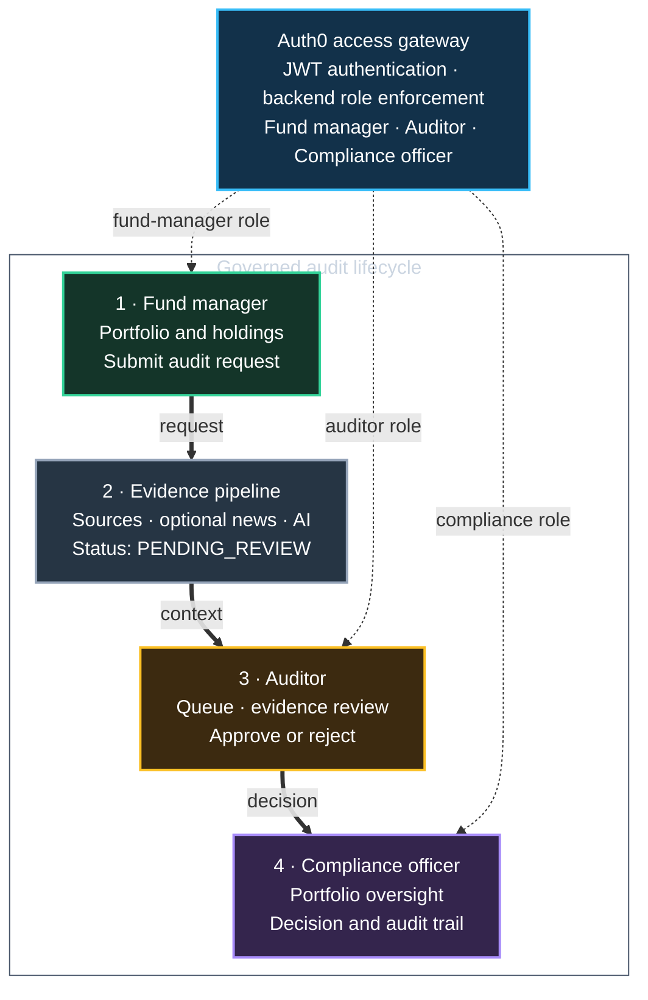

# TrueYield

[](https://github.com/Scampoloni/trueyield/actions/workflows/ci.yml)

TrueYield is an academic prototype exploring how AI-supported evidence collection and human review workflows could support ESG risk analysis.

> **Prototype disclaimer:** TrueYield is not a production-ready compliance platform. It does not provide investment, legal, regulatory, or financial advice, and its outputs must not be used as formal ESG, SFDR, or investment classifications.

## Overview

ESG research and review can involve gathering dispersed public information, documenting its relevance, and having a responsible person make the final decision. TrueYield explores that workflow in one full-stack application.

The prototype lets a fund manager create a portfolio and its holdings, collect supporting evidence, and submit it for review. External news providers can contribute candidate articles; an LLM can help summarise evidence and indicate possible risk themes. An auditor or compliance officer then reviews the evidence and records the workflow outcome. The AI is an assistive component, not a decision-maker.

It demonstrates business-process thinking alongside practical integration work: role-based access, API design, evidence traceability, external services, automated tests, CI/CD, and containerised deployment.

It is written for reviewers who want to understand both the business workflow and the implementation boundaries quickly.

## What problem it explores

The prototype asks how a human-in-the-loop workflow could make an evidence-based ESG review easier to navigate:

1. A fund manager records a portfolio and its holdings.
2. The system stores evidence manually or obtains candidate news items from configured providers.
3. AI-assisted analysis can summarise evidence and surface possible risk context.
4. An auditor reviews the information, comments, and records an outcome.
5. A compliance officer can view a read-only cross-portfolio overview.

This is a workflow prototype. It does not determine regulatory eligibility, verify source accuracy, or replace qualified human judgement.

## Workflow at a glance



Every endpoint verifies the signed-in role. News and AI integrations enrich the evidence packet, but only an auditor can record an approval or rejection.

## Key features

- Three role-oriented views: fund manager, auditor, and compliance officer.
- Portfolio and holding management with an auditable review lifecycle.
- Evidence capture, source links, sentiment/risk indicators, and comments.
- Optional multi-provider news ingestion: Guardian, Newsdata.io, NewsAPI.org, and Alpha Vantage.
- Optional Anthropic-powered evidence summaries, relevance filtering, and chat assistance.
- JWT-based authentication and role handling through Auth0.
- Read-only compliance overview with exploratory, evidence-derived indicators.
- Spring Boot API, SvelteKit user interface, MongoDB persistence, automated tests, Dockerfiles, and GitHub Actions.

## Architecture

```text
SvelteKit web application
        |
        | Auth0 login / JWT
        v
Spring Boot API  <---->  MongoDB
        |
        +----> Optional news providers
        |
        +----> Optional Anthropic API
```

The frontend keeps the Auth0 access token in an HTTP-only cookie and forwards it to the backend API. The backend validates the JWT and applies role checks before accessing portfolio, audit, evidence, or compliance resources. See the [architecture notes](docs/architecture.md) for a fuller walkthrough.

## Technology stack

| Area | Technologies used |
| --- | --- |
| Backend | Java 25, Spring Boot, Spring Security, Spring AI, Spring Data MongoDB |
| Frontend | SvelteKit, Svelte, Vite, Axios |
| Identity | Auth0 with JWT-based role claims |
| Data and integrations | MongoDB, Anthropic, Guardian, Newsdata.io, NewsAPI.org, Alpha Vantage |
| Delivery and quality | Maven, npm, JUnit, Mockito, Testcontainers, Cypress, JaCoCo, Docker, GitHub Actions, Azure App Service |

## Screenshots

The screenshots use sample portfolios and role labels. They illustrate the prototype interface; they are not evidence of a live regulated service.

### Portfolio workspace


### Evidence and risk analysis


### Auditor review and AI-assisted summary


### Compliance overview


The labels shown in the compliance screen are evidence-derived prototype indicators, not SFDR classifications or compliance determinations.

## Login and access model

TrueYield is deliberately **not usable without login**. The UI and backend expect an Auth0 configuration, and the backend protects `/api/**` endpoints with bearer-token authentication. This is important to the workflow: a fund manager creates or submits work, an auditor reviews it, and a compliance officer has a separate read-only perspective.

For local use, configure an Auth0 tenant with:

- an Auth0 application for the SvelteKit frontend;
- an Auth0 API/audience for the Spring Boot backend;
- test users; and
- a `user_roles` claim containing one of `fund-manager`, `auditor`, or `compliance-officer`.

There are no public demo credentials in this repository. Do not add real credentials or user data to issues, examples, or screenshots.

## AI and automation approach

When the optional provider keys are configured, TrueYield can retrieve candidate articles, apply an AI-assisted relevance step, and create an evidence summary or portfolio-level risk narrative. These outputs are prompts for review, not factual determinations. They can be incomplete, inaccurate, biased, or unavailable when a provider is unavailable.

The workflow keeps a human responsible for assessing evidence and selecting an outcome. The application does not independently approve investments, certify sustainability claims, or make compliance decisions. More detail: [AI integration notes](docs/ai-integration.md).

## Testing and quality

The repository contains backend unit, web-layer, repository, and integration tests, plus Cypress end-to-end specifications. GitHub Actions runs frontend checks/builds and backend verification with a JaCoCo threshold for selected core services.

```powershell
# Backend (from backend/)
.\mvnw.cmd verify

# Frontend (from frontend/)
npm ci
npm run check
npm run build
```

Some integration and E2E paths require MongoDB, Auth0 configuration, and/or running application services. See [testing notes](docs/testing.md) for prerequisites and the current validation record.

## Local setup

### Prerequisites

- Java 25 (the Maven build declares Java 25)
- Node.js 22 or later and npm
- MongoDB, locally or remotely reachable
- An Auth0 tenant, application, API audience, and role-configured test users
- Optional: Anthropic and news-provider API keys for AI and news-ingestion features
- Optional: Docker for image builds

### 1. Configure the backend

Copy `backend/.env.example` to a local environment file for your tooling, or export the variables in your shell. Spring Boot itself does not automatically load `.env` files. You may instead copy `backend/src/main/resources/application-local.properties.example` to `application-local.properties` and activate the `local` Spring profile.

At minimum, provide `MONGODB_URI` and `AUTH0_DOMAIN`. Configure a local MongoDB database before starting the backend.

```powershell
cd backend
.\mvnw.cmd spring-boot:run
```

The backend listens on port `8080` by default.

### 2. Configure and start the frontend

Copy `frontend/.env.example` to `frontend/.env` and provide the Auth0 application values plus `API_BASE_URL`.

```powershell
cd frontend
npm ci
npm run dev
```

Vite serves the frontend on `http://localhost:5173` by default. Log in with an Auth0 test user that has one of the roles listed above.

### 3. Optional Docker builds

The repository provides Dockerfiles, but no Docker Compose setup. Build commands require Docker and the same runtime configuration at container start:

```powershell
# From the repository root: backend image
docker build -t trueyield-backend .

# From the repository root: frontend image
docker build -t trueyield-frontend -f frontend/Dockerfile frontend
```

## Environment variables

| Location | Variable | Required | Purpose |
| --- | --- | --- | --- |
| Backend | `MONGODB_URI` | Yes | MongoDB connection URI |
| Backend | `AUTH0_DOMAIN` | Yes | Auth0 tenant domain used to validate JWTs |
| Backend | `ANTHROPIC_API_KEY` | Optional | Enables AI-assisted summaries and chat |
| Backend | `GUARDIAN_API_KEY`, `NEWSDATA_API_KEY`, `NEWSAPIORG_API_KEY`, `ALPHAVANTAGE_API_KEY` | Optional | Enable individual news providers |
| Frontend | `API_BASE_URL` | Yes | Backend API base URL |
| Frontend | `AUTH0_DOMAIN`, `AUTH0_CLIENT_ID`, `AUTH0_AUDIENCE` | Yes | Auth0 application and API configuration |

All examples use fake placeholders. Never commit `.env` files, private connection strings, provider keys, publish profiles, or tokens.

## Deployment status

GitHub Actions defines CI and Azure deployment workflows. A public live-demo link is intentionally not included here: before a deployment is shared, its owners should verify access controls, exposed endpoints, test data, provider costs, and credentials. The deployment workflow is documented in [deployment notes](docs/deployment.md).

## Project context and limitations

TrueYield was created as a ZHAW Business Information Systems academic project. It is a proof of concept for integrating an ESG evidence workflow, not a substitute for a regulated process.

Known limitations include:

- AI and news-provider results depend on configured third-party services and should be reviewed.
- The prototype does not establish source truth, legal compliance, or investment suitability.
- Auth0 configuration and role-managed test users are required; it is not an open anonymous application.
- A Docker Compose developer environment and public demo safety review are not provided.

## AI-assisted development disclosure

TrueYield was developed as a Business Information Systems project with substantial support from modern AI development tools. The author defined the use case, requirements, workflows, and system structure; integrated and tested the components; and validated the resulting functionality. This repository should be understood as an AI-assisted full-stack prototype rather than evidence of expert-level proficiency in every technology used.

## Repository structure

```text
backend/     Spring Boot API, security, services, tests, and backend Dockerfile
frontend/    SvelteKit application, Cypress tests, and frontend Dockerfile
mockdata/    Sample JSON data for development and demonstrations
doc/         Screenshots, diagrams, and deployment evidence
docs/        Portfolio-facing technical notes and preserved academic documentation
.github/     CI/CD workflows and generated coverage badge
```

## Further documentation

- [Architecture](docs/architecture.md)
- [AI integration](docs/ai-integration.md)
- [Testing and quality](docs/testing.md)
- [Deployment safety](docs/deployment.md)
- [Preserved academic documentation](docs/academic-documentation.md)
- [Archived academic artifacts](docs/archive/README.md)

No licence has been added. The repository owner should choose one before making the project public.

For a concise technical tour, start with the workflow above, then review the architecture and test notes.
